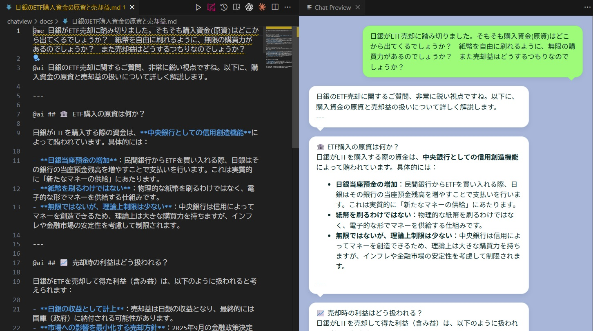

# <p align="center">
  
</p>

# 🗨️ ChatView Enterprise Edition — Lightweight Version for Corporate Environments

**ChatView Enterprise Edition** is a lightweight version designed to meet corporate security requirements. By completely removing browser automation and implementing SVG-only export, it operates safely in environments with SSL certificate issues or proxy restrictions.

---

## 📷 Sample Display



---

## 🏢 Enterprise Edition Features

### ✅ Optimized for Corporate Environments

- **No Browser Automation**: Complete removal of dependencies like Puppeteer and Playwright
- **Lightweight Package**: Dramatically reduced distribution size without browser binaries
- **Enhanced Security**: No external browser process launching, avoiding SSL certificate issues
- **Proxy Environment Compatible**: Unaffected by corporate proxy settings
- **SVG-Only Export**: High-quality vector format output

### ⚠️ Differences from Standard Edition

| Feature | Enterprise Edition | Standard Edition |
|---------|-------------------|------------------|
| Preview Display | ✅ Supported | ✅ Supported |
| SVG Export | ✅ Supported | ✅ Supported |
| PNG Export | ❌ Not Supported | ✅ Supported |
| HTML Export | ❌ Not Supported | ✅ Supported |
| Browser Dependency | ❌ None | ✅ Chrome/Chromium Required |
| Package Size | Small | Large |

---

## 👤 User Guide

### 🚀 How to Use

1. Open a Markdown file (e.g., sample.md) in VS Code
2. Open the Command Palette with Ctrl+Shift+P
3. Run ChatView: Preview display
4. The chat UI will be displayed in the Webview

### 💾 SVG Export

1. While preview is displayed, open Command Palette with Ctrl+Shift+P
2. Run ChatView: Export view as image
3. Specify the save destination and save the SVG file

### 💬 Writing Conversations (Using @ai / @me)

In ChatView, you can easily specify speakers in Markdown. By placing the prefix @ai or @me at the beginning of a line, it will be rendered as an AI-side or user-side bubble respectively.

Example (Markdown):

```markdown
@ai Hi — what would you like to do today?
@me I was thinking about watching a movie.
@ai How about "Interstellar"? It is very moving.
```

Important Specifications:

- Each conversation starts with a line prefixed with @ai or @me
- Subsequent lines without a prefix are treated as "continuation lines" and merged into the same bubble
- Use lowercase @ai / @me at the beginning of the line for prefixes
- Limited Markdown syntax is rendered inside bubbles (headings #, bold **, italic *, inline code \\, lists -, numbered lists, blockquotes >, links [text](url), etc.)
- For SVG export, Markdown formatting is removed and output as plain text

### 🎨 Customizing Appearance

The UI appearance is primarily defined in media/style.css.

Steps for changing in development environment:
1. Edit media/style.css
2. Close and reopen the preview, or reload the extension host window (Ctrl+R)

---

## 🧑‍💻 Developer Guide

### 📦 Project Structure

```
chatview/
├── src/extension.ts       // Extension entry point (includes SVG generation logic)
├── media/style.css        // Chat UI style definitions
├── media/script.js        // Markdown parsing in Webview
├── sample.md              // Sample Markdown for testing
├── .vscode/launch.json    // Debug configuration
├── .vscode/tasks.json     // Build/development task definitions
├── tsconfig.json          // TypeScript compiler settings
└── package.json           // Extension metadata
```

### 🛠 Local Development Steps

Prerequisites:

```powershell
git clone https://github.com/keides2/chatview.git
cd chatview
git checkout enterprise-edition
npm install
```

Testing:

1. Open the project in VS Code
2. Press F5 to launch the extension host
3. In the debug window, open sample.md and run Ctrl+Shift+P → ChatView: Preview display
4. After editing media/style.css, close and reopen the preview

### 🔧 Build and Packaging

```powershell
# Development build
npm run compile

# Production build
npm run package

# Create VSIX package
vsce package
```

---

## 📥 Installation

### System Requirements

- **Visual Studio Code**: Version 1.103.0 or later
- **No Browser Required**: Chrome/Chromium installation is not necessary

### Install from VSIX File

1. Download the .vsix file from the releases page
2. In VS Code, run Ctrl+Shift+P → Extensions: Install from VSIX...
3. Select the downloaded .vsix file

### Build from Source (For Developers)

1. Clone the repository (enterprise-edition branch)
2. Install dependencies with npm install
3. Build with npm run package
4. Launch the extension host with F5

---

## 🔒 Security and Privacy

Enterprise Edition meets the following security requirements:

- **No External Process Launching**: Reduces security risks by not launching browsers
- **No Network Access**: No external communication required for export processing
- **Privacy Protection**: Implementation that does not include personal information (username, etc.) in paths
- **SSL Certificate Issue Avoidance**: Works in corporate self-signed certificate environments without using browser automation

---

## 📋 Configuration Options

### chatPreview.defaultFolder

Specifies the default folder for the save dialog.

- workspace: Workspace root (default)
- home: User home directory
- Absolute path: Any directory path

Example (settings.json):

```json
{
  "chatPreview.defaultFolder": "C:\\Users\\YourName\\Documents\\ChatExports"
}
```

---

## 🆚 Comparison with Standard Edition

### Choose Enterprise Edition When:

- Using in a corporate proxy environment
- Environment with SSL certificate issues
- Browser installation is restricted
- Lightweight package is needed
- SVG format is sufficient

### Choose Standard Edition When:

- PNG format export is required
- HTML format export is required
- Pixel-perfect screenshots are needed

---

## 🐛 Troubleshooting

### Preview Not Displaying

1. Verify VS Code version is 1.103.0 or later
2. Run Developer: Reload Window from the Command Palette

### SVG Export Not Working

1. Verify write permissions for the destination directory
2. Check if the filename contains invalid characters

---

## 📄 License

MIT License
See the LICENSE file for details.

---

## 🔗 Related Links

- [GitHub Repository](https://github.com/keides2/chatview)
- [Standard Edition README](README.md)
- [Issue Reports](https://github.com/keides2/chatview/issues)
