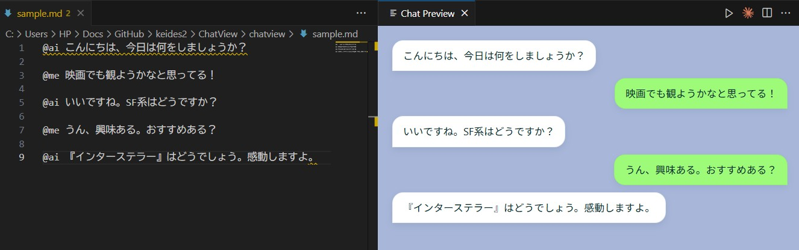

# <p align="center">
  
</p>

# 🗨️ ChatView — MarkdownをLINE風チャットUIでプレビュー表示

**ChatView** は、Markdownファイル内の会話を、Visual Studio Code 上でLINE風のチャットUIとしてプレビュー表示できる拡張機能です。  
スクリーンショット作成や、対話コンテンツの確認に最適です。

---

## 👤 ユーザー向けガイド

### ✅ 主な特徴

- Markdownの会話をチャットUIで表示  
- スタイリッシュな吹き出し（色・角丸・影付き）  
- スクリーンショット素材としても活用可能  
- CSSで簡単に見た目をカスタマイズ可能

### 🚀 使い方

1. VS Code で Markdown ファイル（例：`sample.md`）を開く  
2. `Ctrl+Shift+P` でコマンドパレットを開く  
3. `ChatView: プレビュー表示` を実行  
4. Webview にチャットUIが表示されます！

### 💬 会話の書き方（@ai / @me の使い方）

ChatView では、Markdown 内で発言者を簡単に指定できます。行頭にプレフィックス `@ai` または `@me` を置くと、それぞれ AI 側・ユーザー側の吹き出しとしてレンダリングされます。

例（Markdown）:

```markdown
@ai こんにちは、今日は何をしましょうか？
@me 映画でも観ようかなと思ってる！
@ai 『インターステラー』はどうでしょう。感動しますよ。
```

重要（現在の実装の挙動、更新）:

- 各会話は行頭に `@ai` または `@me` を付けた行から開始します。以降の行で行頭にプレフィックスが無い行は、その直前の吹き出しの「継続行」として同一の吹き出し内にまとめられます。つまり、長いメッセージを複数行に分けて書いても、最初の行にだけ `@ai`/`@me` を書けば OK です。
- プレフィックスは行の先頭で小文字の `@ai` / `@me` を用いてください（先頭に空白がある行や大文字の `@AI`/`@Me` は検出されません）。
- 吹き出し内では限定的な Markdown 構文がレンダリングされます（見出し #, 太字 **, 斜体 *, インラインコード ``, リスト -, 数字リスト, 引用 >, リンク [text](url) などの簡易変換）。
- SVG エクスポートでは Markdown 表記は除去されてプレーンテキストとして出力されます。HTML/PNG エクスポートやプレビューでは簡易的な Markdown レンダリングが行われます。

### 🎨 見た目を変えたいとき（重要）

- UI の見た目は主に `media/style.css` で定義されています。ローカルで見た目を試すときはこのファイルを編集してください。  
- ただし、注意点：
  - 開発環境（リポジトリをクローンして自分の VS Code で F5 → 拡張機能ホストで実行）では、`media/style.css` を編集してプレビューを再表示することで変更を確認できます（手順は下記）。  
  - Marketplace 等からインストールした「公開版」を使っているユーザー環境では、ローカルで `media/style.css` を編集してもそのインストール済み拡張に即時反映されません。公開版を変更するにはソースを修正して再ビルド・再パッケージ化し、拡張を再配布／再インストールする必要があります。

---

## 🧑‍💻 開発者向けガイド

### 📦 プロジェクト構成

```typescript
chatview/
├── src/extension.ts       // 拡張機能のエントリーポイント（Webview の HTML を生成）
├── media/style.css        // チャットUIのスタイル定義（色・レイアウト・フォント） 
├── media/script.js        // Webview 内で Markdown を解析してメッセージを生成するスクリプト（行継続と吹き出し内の限定的な Markdown をサポート）  
├── sample.md              // 表示テスト用Markdown
├── .vscode/launch.json    // デバッグ構成
├── .vscode/tasks.json     // ビルド/開発用タスク定義（例: `npm: watch` をバックグラウンドで実行して TypeScript の監視ビルドを行う）
├── tsconfig.json          // TypeScript コンパイラ設定（出力先やターゲット、strict 等のコンパイルオプションを定義）
└── package.json           // 拡張機能のメタ情報
```

### 🛠 ローカル開発手順

### 事前（必須）

```powershell
git clone https://github.com/keides2/chatview.git
cd chatview
npm install
```

### 動作確認（CSS変更を含む）

1. VS Code でプロジェクトを開く  
2. `F5` を押して拡張機能ホストを起動（デバッグウィンドウが開きます）  
3. デバッグ先ウィンドウで `sample.md` を開き、`Ctrl+Shift+P` → `ChatView: プレビュー表示` を実行  
4. `media/style.css` を編集したら、プレビューを閉じて再度 `ChatView: プレビュー表示` を実行するか、拡張ホストウィンドウをリロード（Ctrl+R）して変更を反映してください。

補足:

- CSS のみの変更なら TypeScript の再ビルドは不要です。ただし拡張が起動済みの場合は再表示／リロードが必要です。  
- DOM 構造（メッセージのクラスや要素）を変えたい場合は `media/script.js` を編集する必要があります。

### 🔧 カスタムHTML/CSSの例

```html
<div class="message ai">こんにちは、今日は何をしましょうか？</div>
<div class="message me">映画でも観ようかなと思ってる！</div>
```

```css
.message {
  padding: 10px 14px;
  border-radius: 14px;
  max-width: 75%;
}
.ai { background: #e0f7fa; }
.me { background: #a5d6a7; text-align: right; }
```

---

## 📷 サンプル表示



---

## 📥 インストール方法

### システム要件

- **Visual Studio Code**: バージョン 1.103.0 以上

### Marketplaceから

1. VS Code の拡張機能ビューで「ChatView」を検索
2. インストールしてすぐ使えます！

### ソースから（開発者向け）

1. リポジトリをクローン  
2. `npm install` で依存関係をインストール  
3. `F5` で拡張機能ホストを起動

---

## 🧾 Puppeteer（レンダリング）に関する重要な注意

ChatView の高品質な画像出力（拡張側で HTML を忠実にレンダリングしてスクリーンショットを取る機能）は、Headless Chrome / Chromium（Puppeteer）を利用しています。本リポジトリは軽量化のため `puppeteer-core` を利用する設計になっており、ユーザー環境に既にインストールされている Chrome/Chromium を使うことを想定しています。以下を必ずご確認ください。

### なぜ `puppeteer-core` なのか？
- `puppeteer-core` はブラウザ本体（Chromium）を含まないため、拡張パッケージのサイズを抑えられます。
- フルの `puppeteer` を依存に入れると Chromium が自動でダウンロードされ、配布・インストール時に大きなダウンロードが発生します（拡張の配布サイズが数百MBになる可能性があります）。

### 動作に必要なもの
- お使いのマシンに Chrome または Chromium がインストールされていること。
- 拡張の設定 `chatPreview.puppeteerExecutablePath` に Chrome/Chromium の実行ファイルパスを設定するか、環境 PATH にある chrome/chromium 実行ファイルを利用できるようにしてください。

例（settings.json）:

```json
"chatPreview.puppeteerExecutablePath": "C:\\Program Files\\Google\\Chrome\\Application\\chrome.exe"
```

### 動作確認（手元で試す手順）
開発環境で Puppeteer を使ってエクスポート処理を試す手順の一例です（ローカルでテストする場合）。

1. まずは依存をインストールします（開発者向け）:

```powershell
npm install
```

2. もし `puppeteer-core` を使う設定のまま試すなら、ローカルに Chrome があることを確認し、`chatPreview.puppeteerExecutablePath` を設定してください。

3. 付属のテストスクリプトで動作検証する（このリポジトリに含まれる簡易テスト）:

```powershell
node scripts\puppeteer-test.js
```

実行すると `out/puppeteer-test.png` にスクリーンショットが保存されます。

---

## 📄 ライセンス

MIT License  
詳細は `LICENSE` ファイルをご確認ください。
